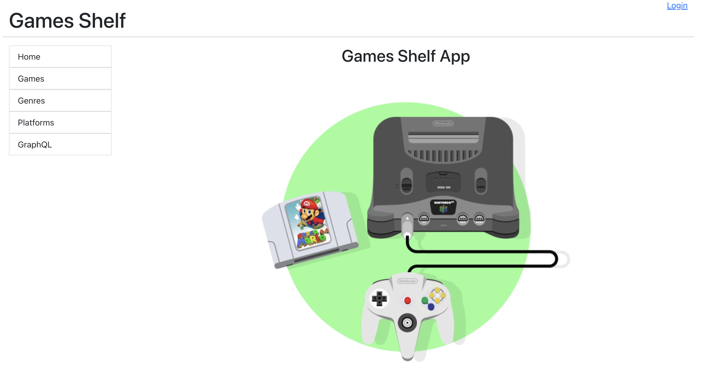
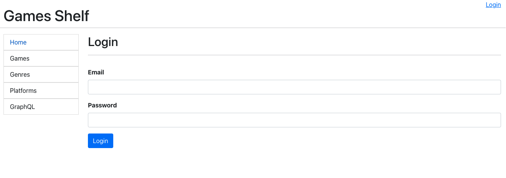
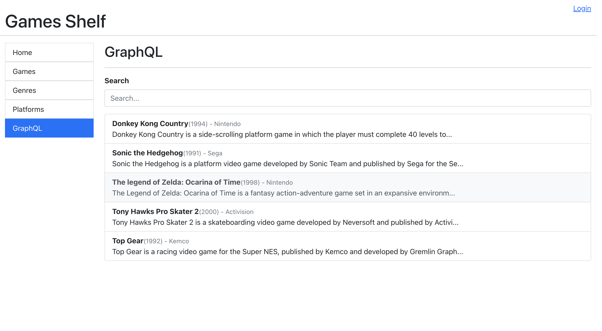
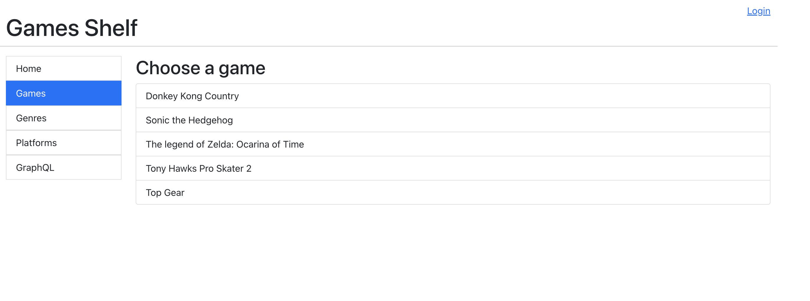
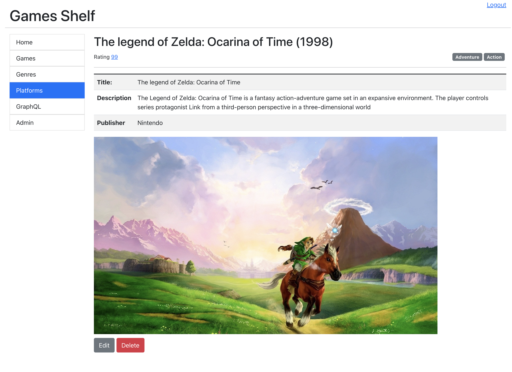
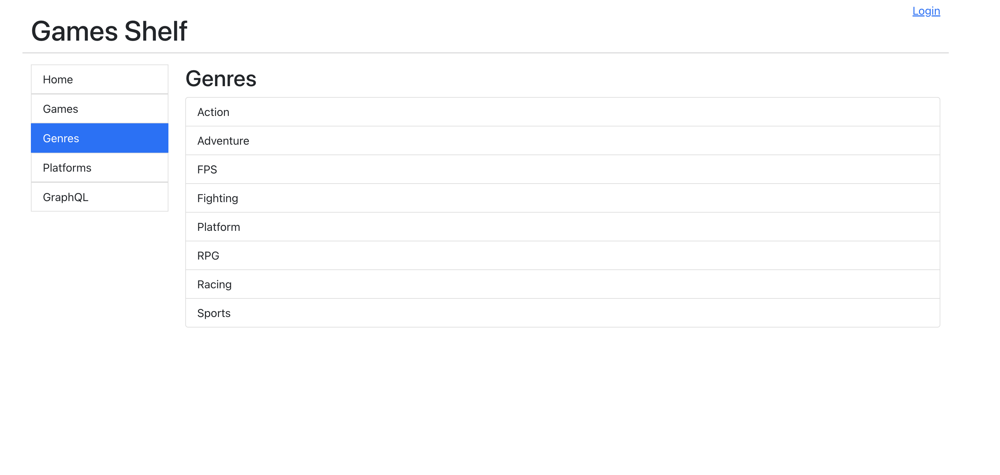
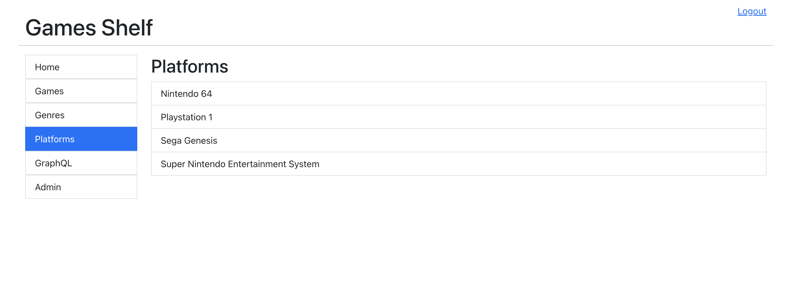

# games-shelf-client-react

Client application developed in React for the Game Shelf app.

This application is created in React, and you have the possibilities to:

- Login using JWT tokens (the user and password need to be managed on the backend
  [project](https://github.com/coderade/games-shelf-api-go))
- CRUD of the games, platforms and genres
- Use GraphQL to search games
- Work with data received from [RAWG](https://rawg.io/) api, the biggest video game database

Some technologies used are:

- React
- Axios
- Bootstrap

Backend API developed in Go available here: [games-shelf-api-go](https://github.com/coderade/games-shelf-api-go).

## Running the application

To run the application you need to have the backend running, To do this check the backend 
[documentation](https://github.com/coderade/games-shelf-api-go).

After this, to run the application in the project directory, you can run:

`npm start`:

Runs the app in the development mode.\
Open [http://localhost:3000](http://localhost:3000) to view it in your browser.

The page will reload when you make changes.\
You may also see any lint errors in the console.

`npm test`:

Launches the test runner in the interactive watch mode.\
See the section about [running tests](https://facebook.github.io/create-react-app/docs/running-tests) for more information.

## Available pages

Some available pages are:

### Login

Page used to log in on the system the user and password need to be managed on the backend
[project](https://github.com/coderade/games-shelf-api-go).

#### GraphQL 

Page used search the games using GraphQL in the backend.

#### Games list

List of the games available 

#### Game Details

Details of the game, also we can Edit and Delete a game if signed.

#### Genres list

List of the genres available 

#### Platforms list

List of the platforms available 